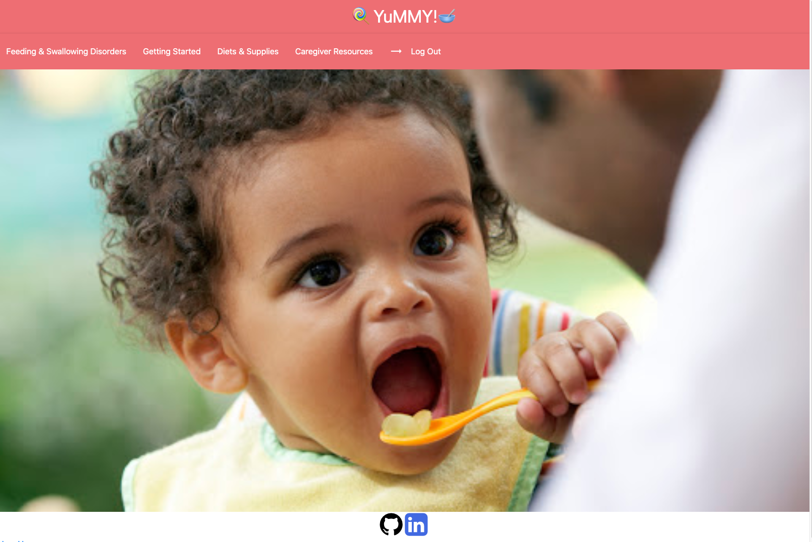
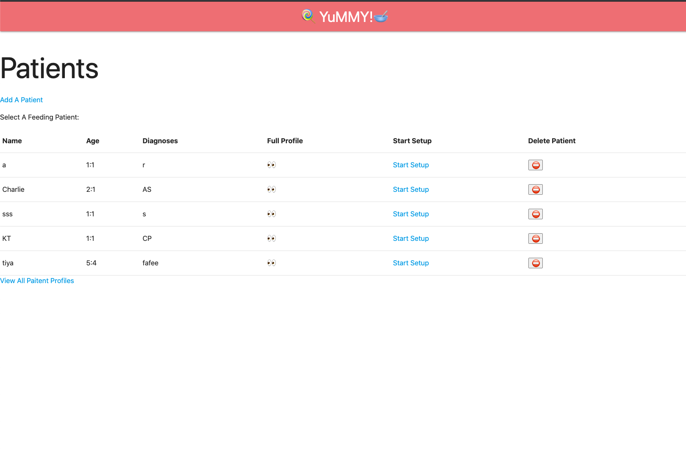
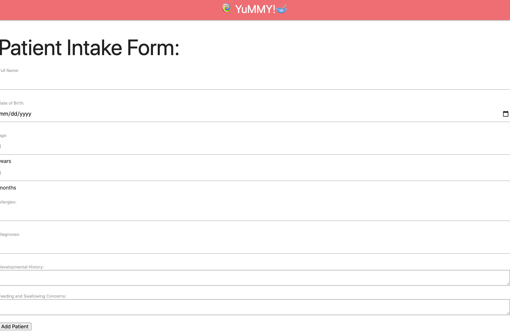
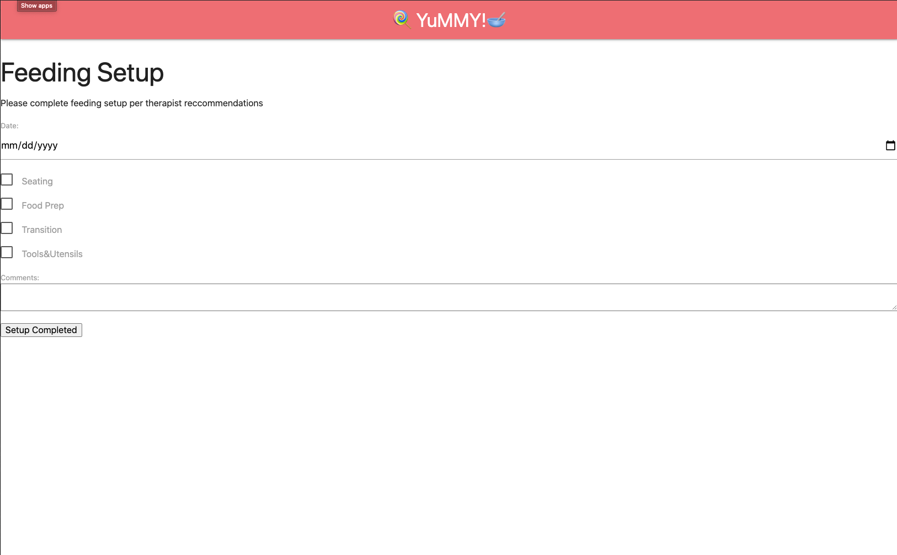

# YuMMY!
### GA: MongoDB,NodeJs Project

#### About the App
This app was designed by a pediatric feeding speech langauge pathogist to provide a user friendly solution for visualtion of feeding data to track progress and interpret data. 
It's simple design is user-friendly is inteded to be a tool for both caregivers and therapists. 

## Technologies: 

```bash
Html, Mongoose, MongoDB, CSS, Google Fonts, Materialize, NodeJs, JavaScript
```

## Features: 

This app is a feeding data tracker. It provides the following features:
Foundational information about feeding and swallowing disorders, a description of the app(about section), information on diet textures and liquid consistencies, and resources for caregivers on the home landing page for any user to access
The app contains restricted features for signed in users(Oauth) incuding creating, editing, deleting and displaying patients and their profiles. 

The app also has the ability to track feeding setup and feeding session data.

Access to creator's LI and GH handles provided at bottom of home page. 

## Images of working app

Landing Page:



Patient Index:



Patient Intake Form:


Feeding Setup Form:


## Getting Started
Explore information and resources about feeding/swallowing disorder on the landing page.
Login with google to use features including creating a patient, adding/deleting/updating patient info, and creating setups and feeding session notes.
https://p2-yummy.herokuapp.com/

## Trello board
https://trello.com/b/QsBFrJwm/project2

## Stretch Goals/Future Goals:
* Age calculator linked to birthdate widget to autopopulate age in years:months
* Working timer on feeding session page which autopopulates time when session completed
* No whitespaced, cleaned up code graveyard, better organzation, naming conventions, and RESTful routing
* Use of more materialize styling options and some tool tips
* Allow user to edit setup up page adding/deleting options for indvidualized feeding setups
* Linking of the data entities
* Access to progress notes printed on show page from patient profile
* Different user login options to link therapists to patients/caregivers and allow for editing and communication within the application
* Kid-friendly tracking option with pictures to allow patients to partipate in charting by selecting foods they are eating, etc. 